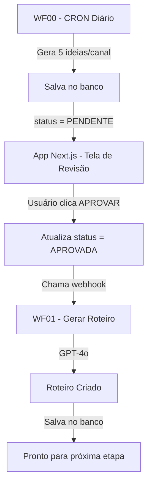

# 🔄 Fluxo de Aprovação de Ideias → Geração de Roteiros

## 📋 Visão Geral do Fluxo



## 🎯 Componentes do Sistema

### 1️⃣ WF00 - Gerador de Ideias (n8n)

- **Trigger**: CRON (diário, configurável)
- **Ação**: Gera 5 ideias por canal usando GPT-4o
- **Output**: Salva no banco com `status = 'PENDENTE'`

### 2️⃣ App Next.js - Tela de Revisão

- **Rota**: `/ideias` ou `/ideias/pendentes`
- **Componente**: `<AprovarIdeiaButton />`
- **Ação**: Usuário revisa e aprova ideias

### 3️⃣ API Route - Aprovação

- **Endpoint**: `POST /api/ideias/[id]/aprovar`
- **Ações**:
  1. Atualiza `status = 'APROVADA'`
  2. Chama webhook do n8n
  3. Retorna resultado

### 4️⃣ WF01 - Gerador de Roteiros (n8n)

- **Trigger**: Webhook `/webhook/ideia-aprovada`
- **Input**: `{ ideia_id: "uuid" }`
- **Ação**: Gera roteiro completo com GPT-4o
- **Output**: Salva roteiro no banco

## 🔧 Configuração

### Variáveis de Ambiente (.env)

```bash
# Webhook do n8n para aprovação de ideias
N8N_WEBHOOK_APROVAR_IDEIA=https://pulsoprojects.app.n8n.cloud/webhook/ideia-aprovada

# Secret para validar chamadas
WEBHOOK_SECRET=seu-secret-seguro-aqui
```

### n8n - Configuração do Webhook

No WF01, o webhook espera este payload:

```json
{
  "ideia_id": "uuid-da-ideia",
  "trigger": "app-aprovacao",
  "timestamp": "2024-12-01T10:30:00Z"
}
```

## 💻 Como Usar no Frontend

### Opção 1: Botão Standalone

```tsx
import { AprovarIdeiaButton } from "@/components/ideias/aprovar-ideia-button";

export function IdeiaCard({ ideia }) {
  return (
    <div>
      <h3>{ideia.titulo}</h3>
      <p>{ideia.descricao}</p>

      <AprovarIdeiaButton
        ideiaId={ideia.id}
        ideiaStatus={ideia.status}
        titulo={ideia.titulo}
        onSuccess={() => {
          console.log("Ideia aprovada!");
          // Refresh lista, redirecionar, etc
        }}
      />
    </div>
  );
}
```

### Opção 2: Chamada Direta da API

```tsx
async function aprovarIdeia(ideiaId: string) {
  const response = await fetch(`/api/ideias/${ideiaId}/aprovar`, {
    method: "POST",
  });

  const data = await response.json();

  if (data.success) {
    console.log("✅ Ideia aprovada:", data.ideia);
    console.log("🤖 Workflow:", data.workflow);
  }
}
```

## 📊 Respostas da API

### Sucesso Total (200)

```json
{
  "success": true,
  "ideia": {
    "id": "uuid",
    "titulo": "Como fazer...",
    "status": "APROVADA",
    "aprovada_em": "2024-12-01T10:30:00Z"
  },
  "workflow": {
    "status": "triggered",
    "message": "Roteiro sendo gerado...",
    "data": { ... }
  }
}
```

### Sucesso Parcial (207 Multi-Status)

```json
{
  "success": true,
  "ideia": { ... },
  "workflow": {
    "status": "error",
    "message": "Não foi possível disparar geração de roteiro",
    "error": "Network error"
  }
}
```

### Erro (500)

```json
{
  "error": "Erro ao aprovar ideia",
  "details": "..."
}
```

## 🔍 Logs e Debug

### No Console do Navegador

```javascript
// Aprovar ideia
📞 Aprovando ideia abc-123...
✅ Resposta da API: { success: true, ... }
🤖 Roteiro sendo gerado pelo n8n...
```

### No Servidor (Next.js)

```bash
✅ Ideia abc-123 aprovada com sucesso
📞 Chamando webhook do n8n: https://...
✅ Workflow WF01 disparado com sucesso
```

### No n8n

- Verifique os logs do workflow WF01
- Confirme que o webhook foi recebido
- Veja o progresso da geração do roteiro

## ⚠️ Tratamento de Erros

| Cenário                 | Comportamento                   |
| ----------------------- | ------------------------------- |
| Webhook não configurado | Ideia aprovada, toast de aviso  |
| Webhook indisponível    | Ideia aprovada, status 207      |
| n8n retorna erro        | Ideia aprovada, log do erro     |
| Ideia já aprovada       | Toast informativo, não processa |
| Ideia não existe        | Erro 500                        |

## 🚀 Próximos Passos

Após WF01 gerar o roteiro:

1. **WF02 - Gerar Áudio** (quando roteiro aprovado)
2. **WF03 - Gerar Vídeo** (quando áudio pronto)
3. **WF04 - Publicar** (quando vídeo renderizado)

## 📝 Checklist de Implementação

- [x] API Route `/api/ideias/[id]/aprovar` criada
- [x] Componente `<AprovarIdeiaButton>` criado
- [x] Variáveis de ambiente configuradas
- [ ] Webhook do n8n ativo e testado
- [ ] WF01 configurado com credenciais
- [ ] Página de ideias pendentes criada
- [ ] Testes end-to-end realizados

## 🧪 Como Testar

1. **Crie uma ideia manualmente** no banco:

```sql
INSERT INTO pulso_content.ideias (canal_id, titulo, descricao, status)
VALUES ('canal-id-aqui', 'Teste de Ideia', 'Descrição teste', 'PENDENTE');
```

2. **Abra a página de ideias** e clique em "Aprovar"

3. **Verifique os logs**:

   - Console do navegador
   - Terminal do Next.js
   - Execuções do n8n

4. **Confirme no banco**:

```sql
SELECT id, titulo, status, aprovada_em FROM pulso_content.ideias WHERE id = 'id-da-ideia';
SELECT * FROM pulso_content.roteiros WHERE ideia_id = 'id-da-ideia';
```

## 🤝 Integração com WF01 (n8n)

O WF01 já está pronto! Ele espera receber:

- `ideia_id`: UUID da ideia aprovada
- Faz JOIN completo buscando canal, série, pipeline
- Valida se status = 'APROVADA'
- Gera roteiro com GPT-4o
- Salva no banco

Tudo que você precisa fazer é:

1. Ativar o workflow no n8n
2. Configurar credenciais (Postgres + OpenAI)
3. Aprovar uma ideia no app! 🎉
