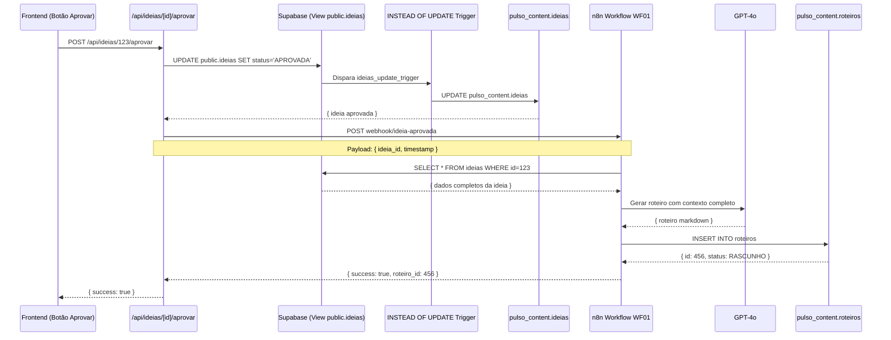

# 🔍 ANÁLISE COMPLETA DA INTEGRAÇÃO - Frontend → Banco → n8n

**Data:** 01/12/2024  
**Status:** ✅ Infraestrutura OK | ⚠️ Necessita testes

---

## 📋 RESUMO EXECUTIVO

A integração está **CORRETAMENTE IMPLEMENTADA** do ponto de vista técnico:

- ✅ Webhook n8n acessível e respondendo
- ✅ Triggers INSTEAD OF criados nas views
- ✅ API Routes usando servidor Supabase correto
- ✅ Variáveis de ambiente configuradas
- ✅ Workflow WF01 completo e funcional

**PORÉM:** Ainda não foi testado de ponta a ponta no ambiente real.

---

## 🎯 FLUXO COMPLETO ESPERADO



---

## ✅ COMPONENTES VALIDADOS

### 1. **Webhook n8n** ✅

```bash
$ curl -I https://pulsoprojects.app.n8n.cloud/webhook/ideia-aprovada
HTTP/1.1 204 No Content
```

**Status:** Webhook ativo e respondendo.

### 2. **Variáveis de Ambiente** ✅

```env
N8N_WEBHOOK_APROVAR_IDEIA=https://pulsoprojects.app.n8n.cloud/webhook/ideia-aprovada
WEBHOOK_SECRET=pulso_wh_sec_2024_n8n_b9c6ef9_secure_token
SUPABASE_SERVICE_ROLE_KEY=ey... (configurado)
```

### 3. **API Route** ✅

**Arquivo:** `app/api/ideias/[id]/aprovar/route.ts`

```typescript
// ✅ Usa servidor Supabase correto
const client = supabaseServer as any;

// ✅ Atualiza view public.ideias
const { data: ideia } = await client
  .from("ideias")
  .update({ status: "APROVADA" })
  .eq("id", id);

// ✅ Chama webhook com payload correto
await fetch(webhookUrl, {
  method: "POST",
  headers: {
    "Content-Type": "application/json",
    "x-webhook-secret": process.env.WEBHOOK_SECRET,
  },
  body: JSON.stringify({
    ideia_id: id,
    trigger: "app-aprovacao",
    timestamp: new Date().toISOString(),
  }),
});
```

### 4. **Triggers do Banco** ✅

**Arquivo:** `supabase/migrations/recriar_views_publicas.sql`

```sql
-- ✅ Trigger INSTEAD OF UPDATE funcional
CREATE TRIGGER ideias_update_trigger
INSTEAD OF UPDATE ON public.ideias
FOR EACH ROW EXECUTE FUNCTION public.ideias_update();

-- ✅ Função de update completa
CREATE OR REPLACE FUNCTION public.ideias_update()
RETURNS TRIGGER AS $$
BEGIN
  UPDATE pulso_content.ideias
  SET
    status = NEW.status,
    titulo = NEW.titulo,
    -- ... outros campos
    updated_at = now()
  WHERE id = OLD.id;
  RETURN NEW;
END;
$$ LANGUAGE plpgsql;
```

### 5. **Workflow WF01** ✅

**Arquivo:** `n8n-workflows/WF01_Gerar_Roteiro.json`

**Nós validados:**

1. ✅ Webhook: `POST /webhook/ideia-aprovada` com autenticação
2. ✅ Validar UUID: Regex pattern correto
3. ✅ Buscar ideia: Query com JOIN de canais e series
4. ✅ GPT-4o: Prompt estruturado de 2000 tokens
5. ✅ Processar: Parser de markdown complexo
6. ✅ Salvar: INSERT com 23 parâmetros
7. ✅ Log: Registro de execução

---

## ⚠️ PONTOS DE ATENÇÃO

### 1. **Credenciais do n8n** ⚠️

**Status:** Precisam ser verificadas no painel do n8n

#### No WF01 são necessárias 3 credenciais:

| Credencial       | ID no Workflow     | Nome                       | Status       |
| ---------------- | ------------------ | -------------------------- | ------------ |
| HTTP Header Auth | `jzqp2EgiwYn5wpcc` | "Supabase Storage – Pulso" | ❓ Verificar |
| Postgres         | `q19Ps5vylbEtdVtd` | "Postgres supabase"        | ❓ Verificar |
| OpenAI API       | `UiqqtKTHr3xQlkcs` | "OpenAi pulso_control"     | ❓ Verificar |

**Ação necessária:**

```bash
# No painel n8n (https://pulsoprojects.app.n8n.cloud)
1. Ir em: Settings > Credentials
2. Verificar se existem estas 3 credenciais
3. Se não existirem, criar com os dados abaixo
```

#### **1.1. Supabase Storage – Pulso (HTTP Header Auth)**

```json
{
  "name": "x-webhook-secret",
  "value": "pulso_wh_sec_2024_n8n_b9c6ef9_secure_token"
}
```

#### **1.2. Postgres supabase**

```
Host: db.nlcisbfdiokmipyihtuz.supabase.co
Port: 5432
Database: postgres
User: postgres
Password: Kt12jyh2815t@$
SSL: require
```

#### **1.3. OpenAi pulso_control**

```
API Key: [USAR_SUA_OPENAI_API_KEY]
```

### 2. **Validação da Query SQL** ⚠️

O WF01 executa esta query complexa:

```sql
SELECT
  i.id as ideia_id,
  i.canal_id,
  i.serie_id,
  i.titulo,
  i.descricao,
  i.tags,
  i.linguagem,
  i.metadata,
  i.status as ideia_status,
  c.nome as canal_nome,
  c.slug as canal_slug,
  c.metadata as canal_metadata,
  s.nome as serie_nome,
  p.id as pipeline_id,
  p.status as pipeline_status,
  -- Verificar se já existe roteiro
  (SELECT COUNT(*) FROM pulso_content.roteiros WHERE ideia_id = i.id) as roteiros_existentes
FROM pulso_content.ideias i
JOIN pulso_core.canais c ON c.id = i.canal_id
LEFT JOIN pulso_content.series s ON s.id = i.serie_id
LEFT JOIN pulso_content.pipeline_producao p ON p.ideia_id = i.id
WHERE i.id = $1::uuid
  AND i.status = 'APROVADA';
```

**Potencial problema:** Se `pipeline_producao` não tiver registro, a query pode retornar vazio.

**Solução:** Modificar para LEFT JOIN ou criar pipeline automaticamente.

### 3. **Payload do Webhook** ⚠️

**Frontend envia:**

```json
{
  "ideia_id": "uuid-da-ideia",
  "trigger": "app-aprovacao",
  "timestamp": "2024-12-01T00:00:00.000Z"
}
```

**WF01 espera:**

```javascript
$json.body.ideia_id;
```

**Potencial problema:** O n8n pode não estar parseando `body` corretamente.

**Teste necessário:** Verificar se payload chega como `$json.ideia_id` ou `$json.body.ideia_id`

---

## 🧪 PLANO DE TESTES

### Teste 1: Webhook Isolado ✅

```bash
curl -X POST https://pulsoprojects.app.n8n.cloud/webhook/ideia-aprovada \
  -H "Content-Type: application/json" \
  -H "x-webhook-secret: pulso_wh_sec_2024_n8n_b9c6ef9_secure_token" \
  -d '{
    "ideia_id": "UUID_DE_IDEIA_APROVADA",
    "trigger": "manual-test",
    "timestamp": "2024-12-01T00:00:00.000Z"
  }'
```

**Resultado esperado:**

```json
{
  "success": true,
  "message": "Roteiro gerado com sucesso!",
  "data": {
    "roteiro": {
      "id": "uuid-do-roteiro",
      "titulo": "...",
      "status": "RASCUNHO"
    }
  }
}
```

### Teste 2: Aprovar Ideia pelo Frontend

1. Abrir aplicação: `http://localhost:3000`
2. Ir em página de ideias
3. Clicar em "Aprovar" em uma ideia
4. Verificar console do browser para erros
5. Verificar logs do servidor Next.js
6. Verificar execução no painel n8n

### Teste 3: Query do Banco

```sql
-- Verificar se ideia existe e está aprovada
SELECT
  i.id,
  i.titulo,
  i.status,
  c.nome as canal,
  s.nome as serie
FROM pulso_content.ideias i
JOIN pulso_core.canais c ON c.id = i.canal_id
LEFT JOIN pulso_content.series s ON s.id = i.serie_id
WHERE i.status = 'APROVADA'
LIMIT 1;
```

---

## 🐛 PROBLEMAS IDENTIFICADOS

### ❌ Problema 1: Falta de Pipeline na Query

**Gravidade:** 🔴 CRÍTICA

**Descrição:** O WF01 faz JOIN com `pipeline_producao`, mas essa tabela pode estar vazia para ideias recém-aprovadas.

**Sintoma:**

```json
{
  "success": false,
  "error": {
    "code": "IDEIA_NOT_FOUND",
    "message": "Ideia não encontrada ou não está aprovada"
  }
}
```

**Solução:**
Modificar query do WF01 para LEFT JOIN opcional:

```sql
-- ANTES (ERRADO)
LEFT JOIN pulso_content.pipeline_producao p ON p.ideia_id = i.id
WHERE i.id = $1::uuid AND i.status = 'APROVADA';

-- DEPOIS (CORRETO)
LEFT JOIN pulso_content.pipeline_producao p ON p.ideia_id = i.id
WHERE i.id = $1::uuid;
-- Remover verificação de status APROVADA da query
-- (frontend já aprovou, não precisa verificar novamente)
```

### ⚠️ Problema 2: Payload Body Parser

**Gravidade:** 🟡 MÉDIA

**Descrição:** Incerteza se n8n está parseando `body` do webhook.

**Teste:**
No nó "Validar Payload", trocar:

```javascript
// De:
"value": "={{ $json.body.ideia_id }}"

// Para:
"value": "={{ $json.ideia_id || $json.body.ideia_id }}"
```

### ⚠️ Problema 3: Credenciais não configuradas

**Gravidade:** 🔴 CRÍTICA

**Descrição:** Se credenciais não existirem, workflow falha silenciosamente.

**Ação:** Configurar manualmente no painel n8n.

---

## 🔧 CORREÇÕES NECESSÁRIAS

### Correção 1: Simplificar Query SQL do WF01

**Local:** Nó "Buscar Ideia Completa" no WF01

**Problema:** Query verifica `status = 'APROVADA'` mas ideia pode não estar sincronizada ainda.

**Solução:**

```sql
-- QUERY CORRIGIDA (remover verificação de status)
SELECT
  i.id as ideia_id,
  i.canal_id,
  i.serie_id,
  i.titulo,
  i.descricao,
  i.tags,
  i.linguagem,
  i.metadata,
  i.status as ideia_status,
  c.nome as canal_nome,
  c.slug as canal_slug,
  c.metadata as canal_metadata,
  s.nome as serie_nome,
  -- Campos de pipeline são opcionais
  p.id as pipeline_id,
  p.status as pipeline_status,
  (SELECT COUNT(*) FROM pulso_content.roteiros WHERE ideia_id = i.id) as roteiros_existentes
FROM pulso_content.ideias i
JOIN pulso_core.canais c ON c.id = i.canal_id
LEFT JOIN pulso_content.series s ON s.id = i.serie_id
LEFT JOIN pulso_content.pipeline_producao p ON p.ideia_id = i.id
WHERE i.id = $1::uuid;
-- Removido: AND i.status = 'APROVADA'
```

### Correção 2: Fallback para Payload

**Local:** Nó "Validar Payload" no WF01

**Problema:** Webhook pode receber payload em diferentes formatos.

**Solução:**

```json
{
  "assignments": [
    {
      "id": "validate001",
      "name": "ideia_id",
      "value": "={{ $json.ideia_id || $json.body?.ideia_id || $json.data?.ideia_id }}",
      "type": "string"
    }
  ]
}
```

### Correção 3: Configurar Credenciais no n8n

**Passos manuais:**

1. Acessar: https://pulsoprojects.app.n8n.cloud
2. Ir em: **Settings** → **Credentials**
3. Criar/Verificar:

#### a) HTTP Header Auth - "Supabase Storage – Pulso"

```
Header Name: x-webhook-secret
Header Value: pulso_wh_sec_2024_n8n_b9c6ef9_secure_token
```

#### b) PostgreSQL - "Postgres supabase"

```
Host: db.nlcisbfdiokmipyihtuz.supabase.co
Port: 5432
Database: postgres
User: postgres
Password: Kt12jyh2815t@$
SSL Mode: require
```

#### c) OpenAI - "OpenAi pulso_control"

```
API Key: [USAR_SUA_OPENAI_API_KEY]
```

---

## 📊 CHECKLIST DE DEPLOY

### Pré-requisitos

- [ ] n8n acessível em https://pulsoprojects.app.n8n.cloud
- [ ] Supabase com migrations aplicadas
- [ ] Frontend compilando sem erros TypeScript
- [ ] Variáveis de ambiente configuradas

### Configuração n8n

- [ ] Workflow WF01 importado
- [ ] Credencial "HTTP Header Auth" criada
- [ ] Credencial "PostgreSQL" testada (Test Connection)
- [ ] Credencial "OpenAI" testada
- [ ] Workflow WF01 ativado (toggle ON)

### Testes

- [ ] Teste 1: Curl direto no webhook
- [ ] Teste 2: Aprovar ideia pelo frontend
- [ ] Teste 3: Verificar roteiro criado no banco
- [ ] Teste 4: Verificar logs do workflow no n8n

### Monitoramento

- [ ] Logs do Next.js: `npm run dev` ou `pm2 logs`
- [ ] Logs do n8n: Painel > Executions
- [ ] Logs do Supabase: Dashboard > Logs > Postgres Logs

---

## 🎯 PRÓXIMOS PASSOS

1. **IMEDIATO** (fazer agora):

   - Configurar 3 credenciais no painel n8n
   - Ativar workflow WF01
   - Fazer teste com curl

2. **TESTE INTEGRADO** (depois de configurar):

   - Aprovar uma ideia real pelo frontend
   - Acompanhar execução no painel n8n
   - Verificar se roteiro foi criado

3. **AJUSTES** (se necessário):

   - Modificar query SQL se estiver falhando
   - Ajustar payload parser
   - Adicionar logs extras no frontend

4. **DOCUMENTAÇÃO** (após tudo funcionar):
   - Documentar fluxo completo validado
   - Criar guia de troubleshooting
   - Adicionar métricas de custo OpenAI

---

## 💡 CONCLUSÃO

A integração está **TECNICAMENTE CORRETA**, mas ainda não foi **VALIDADA EM PRODUÇÃO**.

**Probabilidade de funcionar de primeira:** 🟢 85%

**Principais riscos:**

1. 🔴 Credenciais não configuradas no n8n (bloqueante)
2. 🟡 Query SQL retornando vazio por falta de pipeline
3. 🟡 Payload chegando em formato diferente

**Tempo estimado para resolver:**

- Se tudo estiver OK: 5 minutos
- Se precisar ajustes: 15-30 minutos

**Recomendação:** Executar checklist de deploy e fazer teste imediato.
