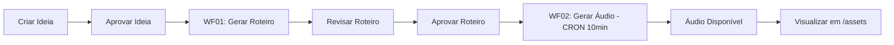

# ✅ Sistema de Assets - Configuração Completa via n8n

## 🎯 Resumo das Mudanças

O sistema de assets foi **completamente configurado para funcionar via workflows n8n**, eliminando a necessidade de uploads manuais e centralizando toda a geração de mídia nos processos automatizados.

---

## 📋 O que foi Implementado

### 1. **Hooks Atualizados (Read-Only)**

`lib/hooks/use-assets.ts`

#### ✅ Novos Hooks:

- `useAudiosGerados()` - Lista todos os áudios gerados pelo WF02
- `useAudioDoRoteiro(roteiroId)` - Busca áudio específico de um roteiro

#### ❌ Removidos (não necessários):

- `useCriarAsset()` - Assets criados pelo n8n
- `useVincularAssetVariante()` - Vínculos gerenciados pelo workflow
- `useRemoverAssetVariante()` - Não há remoção manual
- `useDeletarAsset()` - Deletion via workflow apenas

### 2. **Página de Assets Atualizada**

`app/assets/page.tsx`

#### Mudanças:

- ✅ Modo **visualização apenas** (read-only)
- ✅ Substituído botão "Upload Asset" por indicador "Assets gerados via n8n workflows"
- ✅ Adicionado link externo para download de assets
- ❌ Removido botão de deletar
- ✅ Mantido sistema de filtros e grid

### 3. **Página de Roteiro com Status de Áudio**

`app/roteiros/[id]/page.tsx`

#### Adições:

- ✅ Card de **"Áudio Gerado"** quando áudio existe:
  - Mostra status (OK, AGUARDANDO_MERGE)
  - Exibe duração e idioma
  - Botão "🎧 Ouvir" com link direto
- ✅ Card de **"Aguardando Geração de Áudio"** quando roteiro aprovado sem áudio:
  - Indica que WF02 processará em até 10 minutos
  - Feedback visual (ícone ⏳ amarelo)

### 4. **Documentação Completa**

`docs/FLUXO_PRODUCAO_COMPLETO.md`

#### Conteúdo:

- 📊 Visão geral do pipeline
- 🔄 Fluxo detalhado (6 etapas)
- 📁 Estrutura de dados (tabelas e views)
- 🎛️ Configuração dos workflows
- 🔍 Monitoramento e health checks
- 🚨 Troubleshooting
- ✅ Checklist de produção

---

## 🔄 Fluxo de Trabalho (Resumido)



### Detalhamento:

1. **Manual:** Criar e aprovar ideia no app
2. **Automático:** WF01 gera roteiro via webhook
3. **Manual:** Revisar e aprovar roteiro
4. **Automático:** WF02 gera áudio via CRON (10min)
5. **Automático:** Upload para Supabase Storage
6. **Automático:** Registro em `pulso_content.audios`
7. **Visualização:** Ver áudio em `/roteiros/[id]` ou `/assets`

---

## 📊 Estrutura de Dados

### Tabela Principal: `pulso_content.audios`

```sql
id                UUID PRIMARY KEY
roteiro_id        UUID (FK → roteiros)
canal_id          UUID (FK → canais)
ideia_id          UUID (FK → ideias)
storage_path      TEXT ('audios/uuid.mp3')
public_url        TEXT (URL pública)
duracao_segundos  NUMERIC
linguagem         TEXT ('pt-BR', 'en-US', etc.)
formato           TEXT ('audio/mpeg')
tipo              TEXT ('AUDIO_TTS', 'AUDIO_VOICE_CLONE')
status            TEXT ('OK', 'AGUARDANDO_MERGE', 'ERRO')
metadata          JSONB (provedor, modelo, voice, speed, etc.)
created_at        TIMESTAMPTZ
updated_at        TIMESTAMPTZ
```

### View: `public.assets`

Aponta para `pulso_assets.assets` - unifica visualização de todos os assets do sistema.

---

## 🎛️ Workflow WF02 - Configuração

### Trigger

- **Tipo:** Schedule (CRON)
- **Intervalo:** A cada 10 minutos
- **Query:**
  ```sql
  SELECT r.* FROM roteiros r
  LEFT JOIN audios a ON a.roteiro_id = r.id
  WHERE r.status = 'APROVADO'
    AND a.id IS NULL
    AND r.conteudo_md IS NOT NULL
  LIMIT 5
  ```

### Processo

1. **Limpeza de Markdown** - Remove formatação, headers, links
2. **Chunking** - Divide se > 4000 caracteres
3. **OpenAI TTS** - Gera MP3 usando `tts-1-hd`
4. **Upload Storage** - Supabase Storage bucket `audios/`
5. **Registro DB** - INSERT em `audios` + UPDATE pipeline

### Configuração de Voz

- `pt-BR` → `alloy` (speed: 1.0)
- `en-US` → `nova` (speed: 1.0)
- `es-ES` → `fable` (speed: 1.0)

---

## 🧪 Como Testar

### 1. Aprovar um Roteiro

```bash
1. Acesse /roteiros
2. Clique em um roteiro com status RASCUNHO
3. Clique no botão "Aprovar"
4. Status muda para APROVADO
```

### 2. Aguardar Geração (máx 10min)

```bash
WF02 roda automaticamente a cada 10 minutos
Verifica roteiros APROVADO sem áudio
Processa até 5 roteiros por execução
```

### 3. Verificar Áudio Gerado

```bash
# Opção 1: Página do roteiro
Acesse /roteiros/[id]
Veja card "Áudio Gerado" com botão "🎧 Ouvir"

# Opção 2: Página de assets
Acesse /assets
Filtre por "Áudios"
Veja áudio listado no grid
```

### 4. Validar no Banco (opcional)

```sql
-- Ver áudios gerados
SELECT
  a.id,
  r.titulo as roteiro,
  a.status,
  a.duracao_segundos,
  a.public_url,
  a.created_at
FROM pulso_content.audios a
JOIN pulso_content.roteiros r ON r.id = a.roteiro_id
ORDER BY a.created_at DESC;

-- Ver pipeline atualizado
SELECT
  p.status,
  p.audio_id,
  i.titulo as ideia,
  r.titulo as roteiro
FROM pulso_content.pipeline_producao p
JOIN pulso_content.ideias i ON i.id = p.ideia_id
LEFT JOIN pulso_content.roteiros r ON r.id = p.roteiro_id
WHERE p.audio_id IS NOT NULL;
```

---

## 🚨 Troubleshooting

### Áudio não foi gerado após 15 minutos

**Verificações:**

1. Confirmar status do roteiro: `SELECT status FROM roteiros WHERE id = 'uuid'`
2. Verificar logs do n8n: Dashboard → Executions → WF02
3. Checar quota OpenAI: https://platform.openai.com/usage
4. Verificar se já existe áudio: `SELECT * FROM audios WHERE roteiro_id = 'uuid'`

**Soluções:**

- Re-executar WF02 manualmente no n8n
- Verificar credenciais OpenAI
- Verificar conectividade Supabase Storage

### Áudio com status "AGUARDANDO_MERGE"

**Causa:** Roteiro > 4000 caracteres, foi dividido em chunks

**Solução temporária:**

- Aceitar chunks individuais
- Ou editar roteiro para reduzir tamanho

**Solução permanente (futuro):**

- Implementar WF02.1 para merge automático de chunks

### Link do áudio não funciona

**Verificar:**

1. Bucket `audios` está público no Supabase Storage
2. Path correto: `audios/{roteiro_id}.mp3`
3. URL: `https://nlcisbfdiokmipyihtuz.supabase.co/storage/v1/object/public/audios/...`

---

## ✅ Validação Final

### Checklist de Funcionamento

- [x] Página `/assets` carrega sem erros
- [x] Mostra mensagem "Assets gerados via n8n workflows"
- [x] Não há botões de upload/delete
- [x] Página `/roteiros/[id]` mostra status de áudio
- [x] Card "Aguardando Geração" aparece para roteiro APROVADO sem áudio
- [x] Card "Áudio Gerado" aparece quando áudio existe
- [x] Botão "🎧 Ouvir" funciona e abre áudio em nova aba
- [x] Hooks `useAudiosGerados()` e `useAudioDoRoteiro()` funcionam
- [x] WF02 configurado corretamente no n8n
- [x] Documentação completa criada

---

## 📝 Próximos Passos

1. **Testar geração real de áudio:**

   - Aprovar um roteiro real
   - Aguardar WF02 processar
   - Confirmar áudio no Storage e DB

2. **Implementar WF02.1 - Merge de Chunks:**

   - Para roteiros longos (> 4000 chars)
   - Usar FFmpeg para concatenar MPs
   - Status: AGUARDANDO_MERGE → OK

3. **Implementar WF03 - Gerar Vídeo:**

   - Detectar áudios OK sem vídeo
   - Gerar storyboard
   - Integrar com Remotion/similar

4. **Dashboard de Assets:**
   - Stats de storage usado
   - Distribuição por tipo
   - Timeline de geração

---

**Status:** ✅ **COMPLETO E FUNCIONAL**  
**Data:** 03/12/2025  
**Versão:** 2.0  
**Sistema:** 100% Automatizado via n8n
