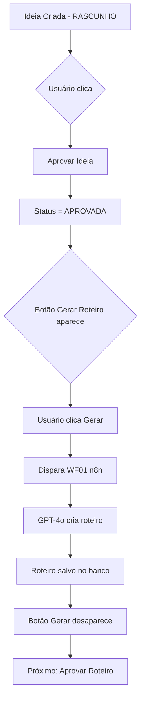

# 🎯 NOVA ESTRUTURA: Aprovação em 2 Fases

## 📋 Resumo das Mudanças

Separamos a aprovação de ideias em **2 ações independentes** para melhor controle:

### ANTES (Problemático):

```
[Aprovar & Gerar Roteiro] → ❌ Fazia 2 coisas ao mesmo tempo
                           → ❌ Sem controle se roteiro já existe
                           → ❌ Difícil debugar problemas
```

### AGORA (Correto):

```
FASE 1: [Aprovar Ideia] → ✅ Apenas muda status para APROVADA
                         → ✅ Desaparece após aprovação

FASE 2: [Gerar Roteiro] → ✅ Dispara WF01 (n8n)
                         → ✅ Só aparece se aprovada E sem roteiro
                         → ✅ Desaparece após roteiro criado
```

---

## 🧩 Componentes Criados

### 1. `ApproveIdeiaButton`

**Quando aparece:**

- Ideia com status `RASCUNHO`, `EM_ANALISE`, etc. (qualquer coisa != APROVADA)

**O que faz:**

- Chama `PATCH /api/ideias/[id]/status`
- Muda status para `APROVADA`
- **NÃO** dispara workflow

**Uso:**

```tsx
<ApproveIdeiaButton
  ideiaId="uuid-da-ideia"
  currentStatus="RASCUNHO"
  onSuccess={() => console.log("Aprovada!")}
/>
```

### 2. `GerarRoteiroButton`

**Quando aparece:**

- Ideia com status `APROVADA`
- **E** ainda não tem roteiro criado (`hasRoteiro: false`)

**O que faz:**

- Chama `POST /api/ideias/[id]/gerar-roteiro`
- Verifica se já existe roteiro
- Dispara webhook WF01 do n8n
- Retorna `roteiro_id` quando criado

**Uso:**

```tsx
<GerarRoteiroButton
  ideiaId="uuid-da-ideia"
  ideiaStatus="APROVADA"
  hasRoteiro={false}
  onSuccess={() => console.log("Roteiro sendo gerado!")}
/>
```

---

## 🛣️ Endpoints de API

### `PATCH /api/ideias/[id]/status`

**Propósito:** Atualizar APENAS o status (sem side effects)

**Request:**

```json
{
  "status": "APROVADA"
}
```

**Response (sucesso):**

```json
{
  "success": true,
  "ideia": {
    "id": "uuid",
    "status": "APROVADA",
    "titulo": "..."
  }
}
```

**Response (erro):**

```json
{
  "error": "permission denied for schema pulso_content"
}
```

---

### `POST /api/ideias/[id]/gerar-roteiro`

**Propósito:** Disparar WF01 para gerar roteiro

**Validações:**

1. ✅ Ideia existe?
2. ✅ Status = APROVADA?
3. ✅ Não tem roteiro ainda?
4. ✅ Webhook configurado?

**Request:** (sem body, apenas POST)

**Response (sucesso):**

```json
{
  "success": true,
  "message": "Roteiro sendo gerado...",
  "ideia": {
    "id": "uuid",
    "titulo": "..."
  },
  "workflow": {
    "status": "triggered",
    "data": { ... }
  },
  "roteiro_id": "uuid-do-roteiro-criado"
}
```

**Response (já existe roteiro):**

```json
{
  "error": "Já existe um roteiro para esta ideia",
  "roteiro_id": "uuid-existente"
}
```

**Response (não aprovada):**

```json
{
  "error": "Ideia precisa estar aprovada antes de gerar roteiro"
}
```

---

## 🎨 Como Usar na UI

### Exemplo: Página de Detalhes da Ideia

```tsx
"use client";

import {
  ApproveIdeiaButton,
  GerarRoteiroButton,
} from "@/components/ui/approve-buttons";

export default function IdeiaDetalhesPage({ ideia, roteiros }) {
  const hasRoteiro = roteiros.length > 0;

  return (
    <div className="space-y-4">
      <h1>{ideia.titulo}</h1>
      <p>Status: {ideia.status}</p>

      <div className="flex gap-2">
        {/* Botão 1: Aprovar (só aparece se não aprovada) */}
        <ApproveIdeiaButton ideiaId={ideia.id} currentStatus={ideia.status} />

        {/* Botão 2: Gerar Roteiro (só aparece se aprovada E sem roteiro) */}
        <GerarRoteiroButton
          ideiaId={ideia.id}
          ideiaStatus={ideia.status}
          hasRoteiro={hasRoteiro}
        />
      </div>

      {/* Indicadores visuais */}
      {ideia.status === "APROVADA" && (
        <div className="bg-green-900/20 border border-green-700 p-3 rounded">
          ✅ Ideia aprovada
        </div>
      )}

      {hasRoteiro && (
        <div className="bg-blue-900/20 border border-blue-700 p-3 rounded">
          📄 Roteiro criado: {roteiros[0].titulo}
        </div>
      )}
    </div>
  );
}
```

---

## 🔄 Fluxo Completo



---

## ✅ Benefícios

1. **Controle Granular**: Cada ação é independente
2. **Prevenção de Duplicatas**: Não tenta gerar roteiro se já existe
3. **Feedback Visual**: Usuário vê exatamente o que está disponível
4. **Debugging Fácil**: Logs separados por endpoint
5. **Rollback Simples**: Se WF01 falhar, ideia já está aprovada

---

## 🧪 Como Testar

### Teste 1: Aprovar Ideia

```bash
# 1. Criar ideia com status RASCUNHO
# 2. Ver botão "Aprovar Ideia"
# 3. Clicar
# 4. Verificar status mudou para APROVADA
# 5. Botão "Aprovar" desapareceu
# 6. Botão "Gerar Roteiro" apareceu
```

### Teste 2: Gerar Roteiro

```bash
# 1. Ideia já aprovada
# 2. Ver botão "Gerar Roteiro"
# 3. Clicar
# 4. Aguardar mensagem "Roteiro sendo gerado..."
# 5. Verificar no n8n: Executions → WF01
# 6. Verificar roteiro criado no banco
# 7. Botão "Gerar Roteiro" desapareceu
```

### Teste 3: Tentativa Duplicada

```bash
# 1. Ideia com roteiro já criado
# 2. Botão "Gerar Roteiro" NÃO aparece
# 3. Se chamar API manualmente: retorna erro
```

---

## 🐛 Troubleshooting

### Erro: "permission denied"

**Causa:** Usando ANON_KEY em vez de SERVICE_ROLE_KEY  
**Solução:** Verificar `.env` tem `SUPABASE_SERVICE_ROLE_KEY`

### Erro: "Já existe um roteiro"

**Causa:** Tentando gerar roteiro duplicado  
**Solução:** Normal! Botão não deveria aparecer

### Erro: "Ideia precisa estar aprovada"

**Causa:** Tentando gerar roteiro sem aprovar antes  
**Solução:** Clicar em "Aprovar Ideia" primeiro

### Webhook não dispara

**Causa:** `N8N_WEBHOOK_APROVAR_IDEIA` não configurado  
**Solução:** Adicionar no `.env`

---

## 📝 Próximos Passos

1. ✅ Refatorar páginas para usar novos botões
2. ⏳ Adicionar badge de "Roteiro Gerado" na UI
3. ⏳ Criar hook `useIdeiaStatus` para lógica reutilizável
4. ⏳ Adicionar notificações toast em vez de `alert()`
