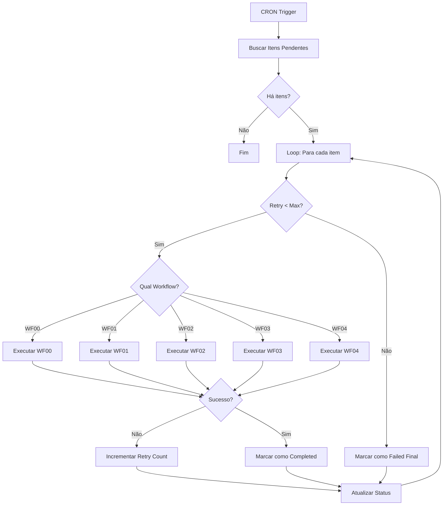

# Workflow WF99 - Recovery & Retry System

## Descrição

Workflow automático que monitora a fila de workflows com falha (`workflow_queue`) e tenta reexecutá-los automaticamente.

## Trigger

- **Tipo:** Schedule/CRON
- **Frequência:** A cada 5 minutos
- **Expressão CRON:** `*/5 * * * *`

## Fluxo do Workflow



## Configuração do Workflow no n8n

### 1. Nó Schedule Trigger

```json
{
  "name": "Schedule Trigger",
  "type": "n8n-nodes-base.scheduleTrigger",
  "parameters": {
    "rule": {
      "interval": [
        {
          "field": "minutes",
          "minutesInterval": 5
        }
      ]
    }
  }
}
```

### 2. Buscar Itens Pendentes (Supabase)

```json
{
  "name": "Buscar Itens Pendentes",
  "type": "n8n-nodes-base.supabase",
  "parameters": {
    "operation": "getAll",
    "tableId": "workflow_queue",
    "returnAll": false,
    "limit": 50,
    "filters": {
      "conditions": [
        {
          "keyName": "status",
          "condition": "equals",
          "keyValue": "pending"
        },
        {
          "keyName": "retry_count",
          "condition": "smallerThan",
          "keyValue": "={{ $json.max_retries }}"
        }
      ]
    },
    "sort": [
      {
        "keyName": "created_at",
        "direction": "asc"
      }
    ]
  }
}
```

### 3. Loop nos Itens

```json
{
  "name": "Loop Items",
  "type": "n8n-nodes-base.splitInBatches",
  "parameters": {
    "batchSize": 1,
    "options": {}
  }
}
```

### 4. Switch - Determinar Workflow

```json
{
  "name": "Switch Workflow",
  "type": "n8n-nodes-base.switch",
  "parameters": {
    "dataPropertyName": "workflow_name",
    "rules": {
      "rules": [
        {
          "value": "WF00",
          "output": 0
        },
        {
          "value": "WF01",
          "output": 1
        },
        {
          "value": "WF02",
          "output": 2
        },
        {
          "value": "WF03",
          "output": 3
        },
        {
          "value": "WF04",
          "output": 4
        }
      ]
    },
    "fallbackOutput": 5
  }
}
```

### 5. Executar Sub-Workflows

Para cada saída do Switch, adicione um nó **Execute Workflow**:

#### Output 0 - WF00

```json
{
  "name": "Execute WF00",
  "type": "n8n-nodes-base.executeWorkflow",
  "parameters": {
    "workflowId": "ID_DO_WF00",
    "source": "parameter",
    "options": {
      "waitForSubWorkflow": true
    }
  }
}
```

Repita para WF01, WF02, WF03, WF04 (outputs 1-4).

### 6. Verificar Sucesso

```json
{
  "name": "Check Success",
  "type": "n8n-nodes-base.if",
  "parameters": {
    "conditions": {
      "boolean": [
        {
          "value1": "={{ $json.success }}",
          "value2": true
        }
      ]
    }
  }
}
```

### 7a. Marcar como Completed (Sucesso)

```json
{
  "name": "Mark Completed",
  "type": "n8n-nodes-base.supabase",
  "parameters": {
    "operation": "update",
    "tableId": "workflow_queue",
    "id": "={{ $node['Buscar Itens Pendentes'].json.id }}",
    "fieldsUi": {
      "fieldValues": [
        {
          "fieldName": "status",
          "fieldValue": "completed"
        },
        {
          "fieldName": "completed_at",
          "fieldValue": "={{ new Date().toISOString() }}"
        }
      ]
    }
  }
}
```

### 7b. Incrementar Retry (Falha)

```json
{
  "name": "Increment Retry",
  "type": "n8n-nodes-base.supabase",
  "parameters": {
    "operation": "update",
    "tableId": "workflow_queue",
    "id": "={{ $node['Buscar Itens Pendentes'].json.id }}",
    "fieldsUi": {
      "fieldValues": [
        {
          "fieldName": "retry_count",
          "fieldValue": "={{ $node['Buscar Itens Pendentes'].json.retry_count + 1 }}"
        },
        {
          "fieldName": "status",
          "fieldValue": "={{ $node['Buscar Itens Pendentes'].json.retry_count + 1 >= $node['Buscar Itens Pendentes'].json.max_retries ? 'failed' : 'pending' }}"
        },
        {
          "fieldName": "error_message",
          "fieldValue": "={{ $json.error || 'Retry failed' }}"
        }
      ]
    }
  }
}
```

### 8. Log de Execução

```json
{
  "name": "Log Execution",
  "type": "n8n-nodes-base.supabase",
  "parameters": {
    "operation": "insert",
    "tableId": "logs_workflows",
    "fieldsUi": {
      "fieldValues": [
        {
          "fieldName": "workflow_name",
          "fieldValue": "WF99 - Recovery"
        },
        {
          "fieldName": "status",
          "fieldValue": "={{ $json.status === 'completed' ? 'sucesso' : 'erro' }}"
        },
        {
          "fieldName": "detalhes",
          "fieldValue": "={{ { original_workflow: $node['Buscar Itens Pendentes'].json.workflow_name, retry_count: $node['Buscar Itens Pendentes'].json.retry_count } }}"
        }
      ]
    }
  }
}
```

## Configuração da Tabela workflow_queue

A tabela já foi criada pela migration `create_workflow_queue.sql`. Certifique-se de que existe:

```sql
-- Verificar se a tabela existe
SELECT * FROM pulso_automation.workflow_queue LIMIT 1;
```

## Testando o WF99

### 1. Adicionar Item de Teste na Fila

```sql
INSERT INTO pulso_automation.workflow_queue (workflow_name, payload, status, max_retries)
VALUES ('WF00', '{"canal_id": "uuid-do-canal"}', 'pending', 3);
```

### 2. Executar WF99 Manualmente

1. Abra o WF99 no n8n
2. Clique em "Execute Workflow"
3. Observe a execução

### 3. Verificar Resultados

```sql
-- Ver status do item
SELECT * FROM pulso_automation.workflow_queue ORDER BY created_at DESC LIMIT 5;

-- Ver logs
SELECT * FROM pulso_content.logs_workflows WHERE workflow_name = 'WF99 - Recovery' ORDER BY created_at DESC LIMIT 10;
```

## Estratégia de Retry

### Backoff Exponencial (Opcional)

Para implementar backoff exponencial, adicione um campo `scheduled_at` na tabela e modifique a query:

```sql
-- Na busca de itens pendentes, adicionar condição:
WHERE status = 'pending'
  AND (scheduled_at IS NULL OR scheduled_at <= NOW())
  AND retry_count < max_retries
```

E ao incrementar retry:

```javascript
// No nó de incrementar retry
const retryCount = $node["Buscar Itens Pendentes"].json.retry_count + 1;
const backoffMinutes = Math.pow(2, retryCount); // 2, 4, 8, 16...
const scheduledAt = new Date(Date.now() + backoffMinutes * 60000).toISOString();

return {
  retry_count: retryCount,
  scheduled_at: scheduledAt,
  status: retryCount >= maxRetries ? "failed" : "pending",
};
```

## Monitoramento

### Dashboard de Fila

Crie uma página em `/workflows/queue` para visualizar:

- Itens pendentes
- Itens em processamento
- Itens com falha
- Taxa de sucesso/falha
- Tempo médio de retry

### Alertas

Configure alertas para:

- Muitos itens com falha (> 10)
- Items stuck (pending há mais de 1 hora)
- Taxa de falha alta (> 30%)

## Melhores Práticas

1. **Limite de Retries**: Use 3-5 retries no máximo
2. **Timeout**: Configure timeout de 5-10 minutos por workflow
3. **Limpeza**: Execute limpeza semanal de items antigos
4. **Logs**: Sempre registre motivo da falha
5. **Monitoramento**: Acompanhe métricas da fila

## Troubleshooting

### Items não estão sendo processados

1. Verifique se WF99 está ativo
2. Confirme que o CRON está rodando
3. Verifique logs do n8n

### Loops infinitos

1. Certifique-se de incrementar `retry_count`
2. Verifique condição `retry_count < max_retries`
3. Confirme que status muda para 'failed' quando excede

### Performance

1. Limite batch size (recomendado: 10-20 items)
2. Adicione índices na tabela
3. Use query eficiente com LIMIT

## Próximos Passos

1. ✅ Criar tabela workflow_queue
2. ⏳ Implementar WF99 no n8n
3. ⏳ Testar com workflows reais
4. ⏳ Adicionar dashboard de monitoramento
5. ⏳ Implementar alertas automáticos
